# Installation for SAP BTP Kyma and HANA Cloud

The Graph Universe (GUV) can be installed on the SAP Business Technology Platform (BTP). The SAP Kyma environment is a Kubernetes (K8S) environment within the SAP BTP. As a persistence layer the SAP HANA Cloud database can be used. 

The required installation steps are described here.

## Prerequisites

The following components are required:

1. SAP BTP account
2. SAP Kyma Cluster
3. SAP HANA Cloud Instance

You can get a trial acess for free. See the [SAP Developer Tutorials](https://developers.sap.com/tutorial-navigator.html) and search for "Kyma" and "HANA".

## Check the HANA database

Login to your SAP BTP subaccount and select "Instances and Subscriptions". You should find an installed "SAP HANA Cloud" Application. 

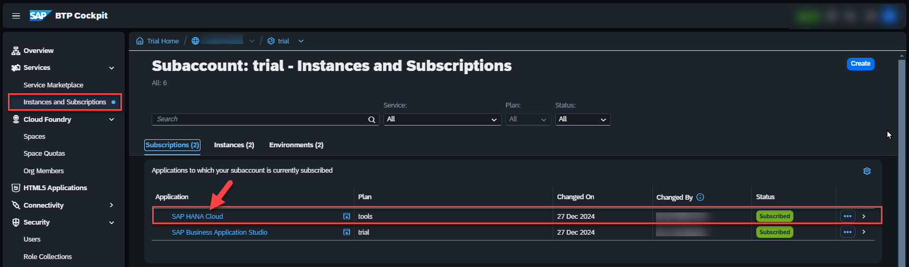

Enter the "HANA Cloud Central" Cockpit by selecting the "SAP HANA Cloud" application.

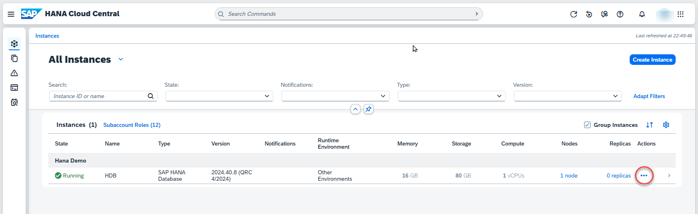.

Enter the context menu via "Action" and select "Copy SQL Endpoint". 

Your copied endpoint should be like this:

`0cf183xx-xxxa-xx71-83xx-5ff37xxx324.hana.trial-us10.hanacloud.ondemand.com:443`

Check the DB user and password to access this instance.  


## Prepare the Kyma cluster

Go to your SAP BTP subaccount "Overview" and check the "Kyma Environment". 

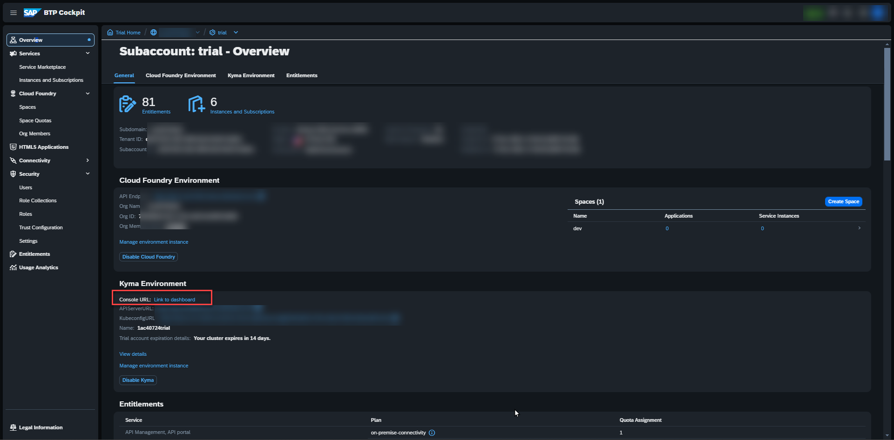

Select the "Link to dashboard".

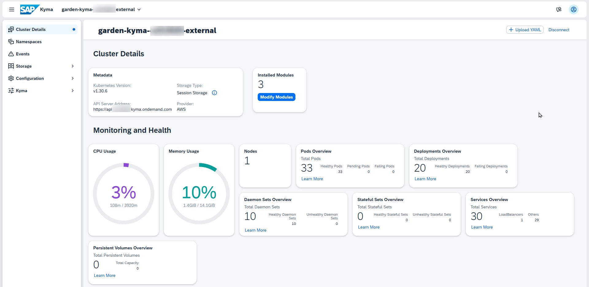

### Create a namespace

Select `Namespaces` and `Create`. 

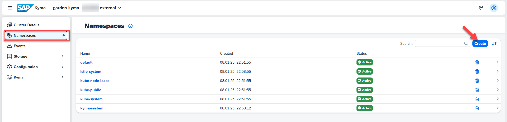

Switch to the "Form" view. Enter a valid name: e.g. `guv-demo` and confirm with `Create`. 

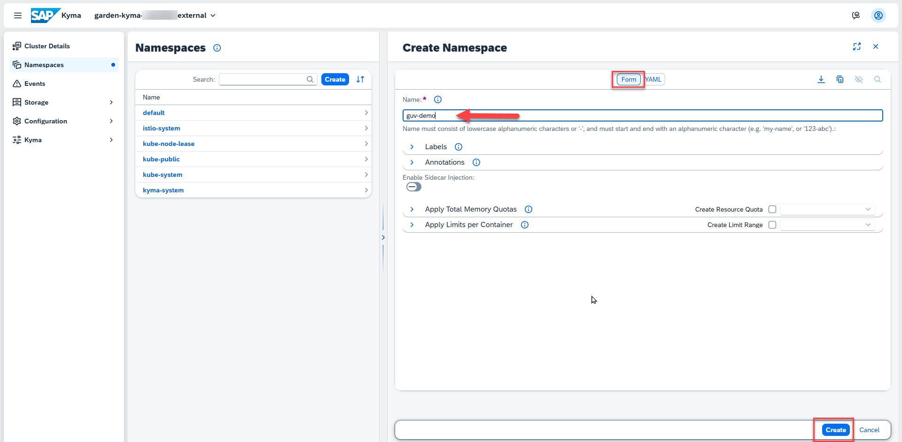

A new Kyma namespace is visible and You will see an empty dashboard.

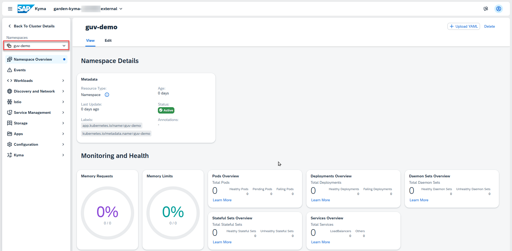

### Create the secrets for HANA

In this step You will create a secret for storing the secret connection information to the HANA Cloud database.

Enter `Configuration` and `Secret`.

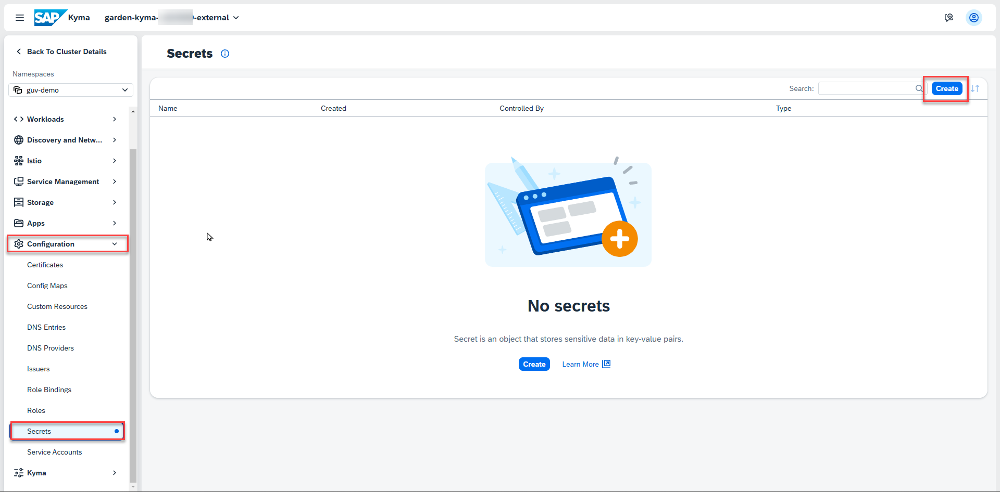

Select `Create`. 

Fill the scret form:
- select the `Form` view if not selected
- use `guv-db`as name for the secret
- select `Type` = `Opaque` 
- enter `hana://` + <your hana database endpoint> as parameter `url`
- enter your DB User as parameter `user` - e.g. DBADMIN
- enter your DB Password as parameter `password`

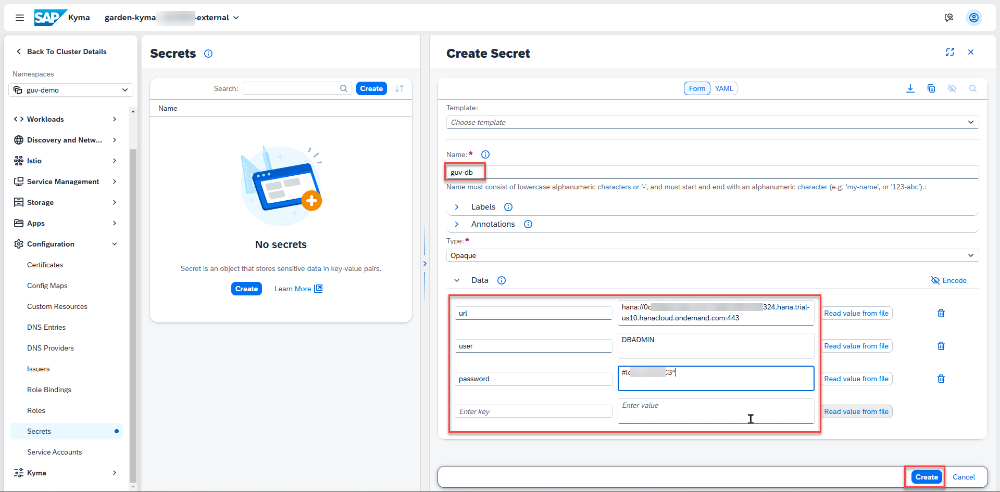

Select `Create`.

### Create deployment

In this step the required kubernetes artifacts are created by a complex yaml file. 

Enter the `Namespace Overview` and get your cluster id. You will find this at the top.

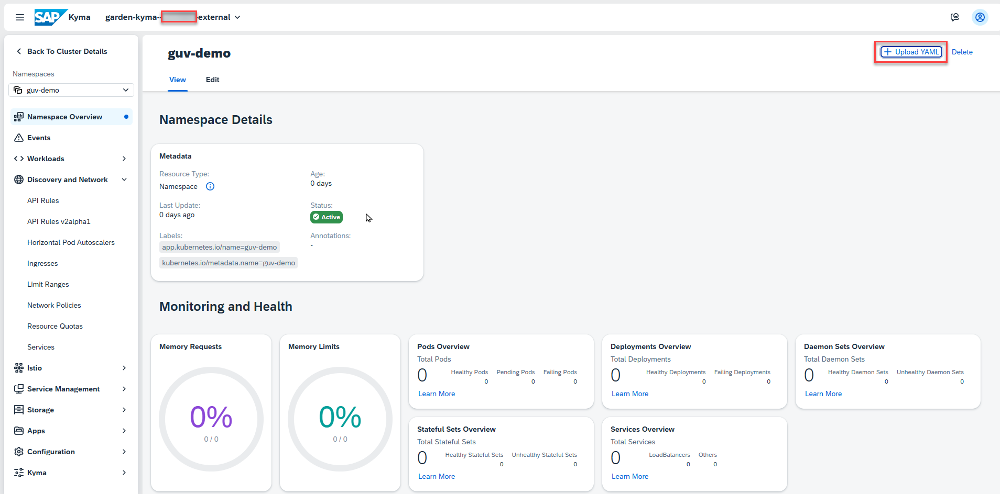

Copy the following yaml snippet to the clipboard.

```yaml
kind: PersistentVolumeClaim
apiVersion: v1
metadata:
  name: guv-srv-data
  labels:
    app: guv
spec:
  accessModes:
    - ReadWriteOnce
  resources:
    requests:
      storage: 100Mi

---
apiVersion: apps/v1
kind: Deployment
metadata:
  name: guv-api
  labels:
    app: guv
spec:
  replicas: 5
  selector:
    matchLabels:
      app: guv
  template:
    metadata:
      labels:
        app: guv
    spec:
      terminationGracePeriodSeconds: 10
      containers:
        - name: guv-api
          image: ghcr.io/b-tocs/btocs_guvapi
          imagePullPolicy: Always
          ports:
            - containerPort: 8000
          env:
            - name: SERVER_ROLE
              value: "demo"
            - name: PYTHONUNBUFFERED
              value: "1"
            - name: B2X_RESTAPI_CORS_ENABLED
              value: "true"
            - name: B2X_RESTAPI_CORS_HOSTS
              value: '["*"]'
            - name: B2X_RESTAPI_CORS_METHODS
              value: '["*"]'
            - name: B2X_RESTAPI_CORS_HEADERS
              value: '["*"]'
            - name: B2X_REDIS_DEFAULT_HOST
              value: guv-kvc
            - name: DB_CONNECT_URL
              valueFrom:
                secretKeyRef:
                  name: guv-db
                  key: url
            - name: DB_USER
              valueFrom:
                secretKeyRef:
                  name: guv-db
                  key: user
            - name: DB_PASSWORD
              valueFrom:
                secretKeyRef:
                  name: guv-db
                  key: password
          volumeMounts:
            - name: guv-srv-data
              mountPath: /data
      volumes:
        - name: guv-srv-data
          persistentVolumeClaim:
            claimName: guv-srv-data

---
apiVersion: v1
kind: Service
metadata:
  name: guv-api
  labels:
    app: guv
spec:
  selector:
    app: guv
  ports:
    - protocol: TCP
      port: 8000
      targetPort: 8000

---
apiVersion: gateway.kyma-project.io/v1beta1
kind: APIRule
metadata:
  labels:
    app.kubernetes.io/name: guv-demo-api
  name: guv-demo-api
  namespace: guv-demo
spec:
  gateway: kyma-system/kyma-gateway
  host: guv-demo-api.<your cluster>.kyma.ondemand.com
  rules:
    - accessStrategies:
        - handler: no_auth
      methods:
        - GET
        - POST
        - PUT
        - DELETE
        - PATCH
        - HEAD
        - OPTIONS
        - CONNECT
        - TRACE
      path: /.*
  service:
    name: guv-api
    port: 8000
```

Select the button `Upload YAML` and insert the clipboard at the left text area.

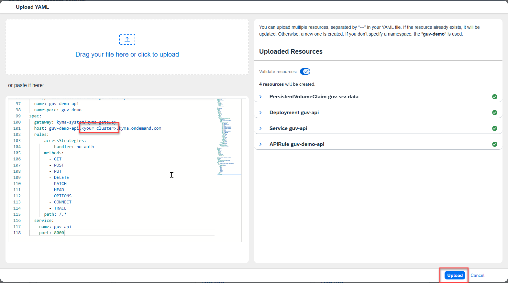

Change the text `your cluster id` with the id of your cluster: e.g. `a12345678`. 

Tip: You will find this id in the url of the current Kyma dashboard view too.

Push the `Upload` button now. You should get a success information.

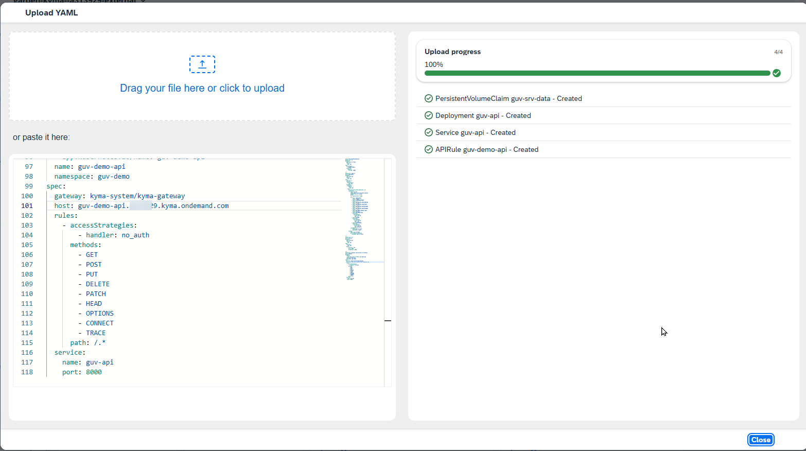

Close the popup.

### Check the GUV API Service

Go to `Discovery and Network` and select `API Rules`. A new created rule `guv-demo-api` should be displayed. Select this rule.

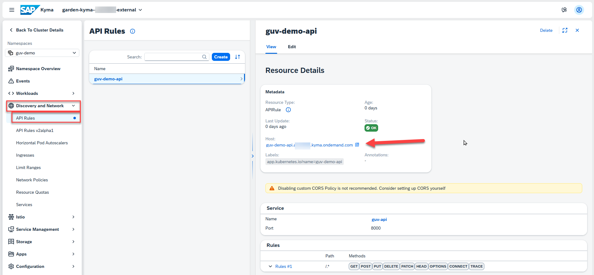

You will find the endpoint URL of the GUV API service in `Metadata` -> `host'. Select this URL.
A local brower should be opened and You will see this output.

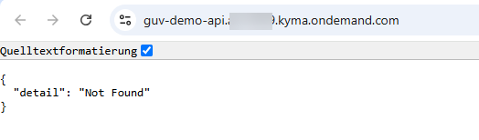

Append a `/info` the the URL and You will get a detailed information.

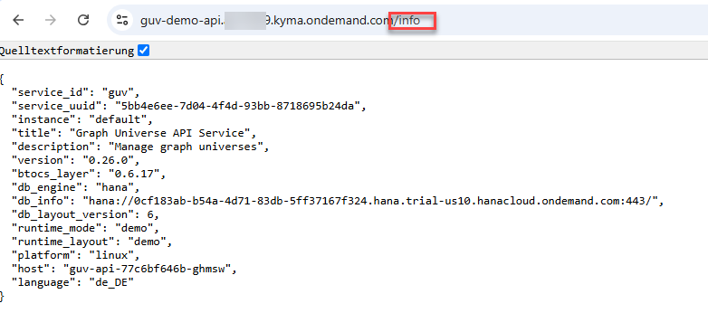


## Conclusion and further information

With these steps you have installed an GUV API service on top of an SAP HANA Cloud database within an kubernetes environment for demo purposes. 

### Scalability

The service runs with 5 replicas to demonstrate the scalabilty. You can modify this by changing the deployment `guv-api`.

### Configuration

The service can be configured by environment variables. This can be done by changing the deployment.

### Security

The demo service is configured unsecure by default and will be configured by environment variables. See the documentation for the GUV API Service.  

You can add SAP BTP security options by changing the api rule.

### Additional services

The GUV API Service can be enhanced by other services in the same namespace like REDIS as Cache, AI or eventing services. See the corresponding documentation and add deployments to your namespace. 