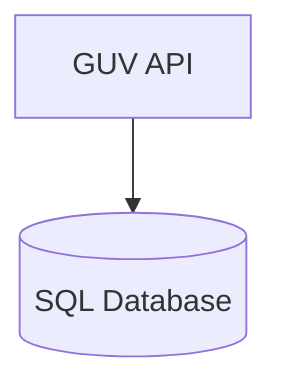

# Graph Universe Big Picture

The graph universe is a API layer on top of an SQL database to serve a low code graph environment. The main idea is to use this as a "Data Universe" - a graph based data storage for different usecases. 

The graph API (aka GUV API) is docker based and can be called via an OpenAPI REST API. There are client libraries for SAP ABAP and Python available.

